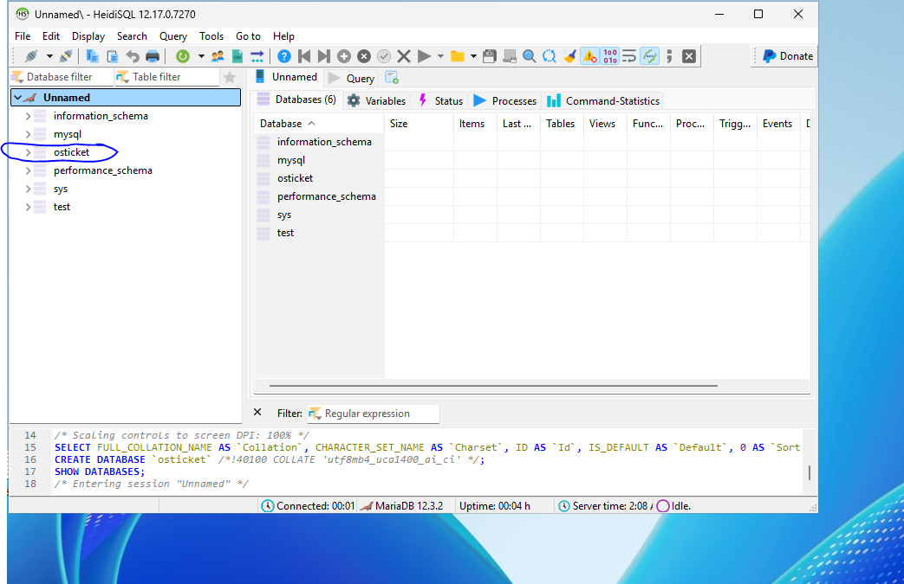

# Deploying osTicket on Microsoft Azure (Windows Server 2025)

This project demonstrates a **complete end-to-end deployment** of osTicket (open-source helpdesk/ticketing system) on Microsoft Azure using Windows Server 2025, IIS, PHP, and MariaDB.

## Project Overview
- **Platform**: Microsoft Azure
- **Operating System**: Windows Server 2025 Datacenter (Desktop Experience)
- **Web Server**: Internet Information Services (IIS)
- **Purpose**: To showcase cloud deployment skills, proper server configuration, and a fully functional helpdesk system.

## Environments and Technologies Used
- **Cloud Platform**: Microsoft Azure (Free Trial)
- **Virtual Machine**: Windows Server 2025 Datacenter
- **Web Server**: IIS 10
- **Runtime**: PHP 8.2+ (Non-Thread Safe)
- **Database**: MariaDB 10.11 or MySQL 8.0+
- **Management Tool**: PHP Manager for IIS
- **osTicket Version**: v1.18.x (latest)

## Architecture
- Azure VM with public IP (RDP access)
- IIS hosting osTicket web application
- MariaDB running on the same VM
- All components installed and configured manually for learning purposes

## Step 1: Creating the Azure Virtual Machine

1. Logged into the [Azure Portal](https://portal.azure.com) using a Free Trial account.
2. Created a new Resource Group: `osTicket-Project-RG`
3. Created a Windows Server 2025 VM with the following settings:
   - Name: `osticket-win2025`
   - Region: [Your Region, e.g. East US]
   - Image: Datacenter for Windows Server 2025 - x64 Gen2
   - Size: Standard D2s_v3 (2 vCPU, 8 GiB RAM)
   - Authentication: Password (Admin username + strong password)
   - Inbound Ports: RDP (3389)

**Screenshots**:

**1. Creating the Resource Group**  

**2. Create VM Basics Tab**  

**3. Review + Create Summary**  

**4. Deployment Complete**  

## Step 2: Connecting to the VM & Initial Setup

After deployment, I connected to the Windows Server 2025 VM.

### Connection Process:
1. In Azure Portal → VM Overview → Clicked **Connect** → **RDP** → Downloaded the RDP file.
2. Opened the `.rdp` file and logged in with the admin credentials.

### Initial Configuration in Server Manager:
- Opened **Server Manager** (it launches automatically on login).
- Installed latest **Windows Updates**.
- Renamed the computer from the default to `OSTICKET-SRV`.
- Checked the dashboard for any warnings or configuration tasks.

**Screenshots**:

**1. Downloading RDP File**  

**2. RDP Connection Screen**  

**3. Server Manager Dashboard**  

**4. Running Windows Update**  

**5. Renaming the Computer**  

## Step 3: Installing IIS

With the base server ready, I installed Internet Information Services (IIS) — the web server needed to run osTicket.

### Installation Steps:
1. In Server Manager, went to **Add Roles and Features**.
2. Selected **Web Server (IIS)** role.
3. Ensured **CGI** was checked under Application Development (required for PHP).
4. Installed the role and **URL Rewrite** module.
5. Verified IIS by browsing to `http://localhost`.

**Screenshots**:

**Add Roles and Features Wizard**  

**Web Server (IIS) Selected**  
%20selected.PNG)

**CGI Checked**  

**Installation Progress**  

**IIS Welcome Page at localhost**  

## Step 4: Installing PHP

PHP is required to run osTicket. I installed a recent version of PHP 8.x (Non-Thread Safe for IIS).

### Installation Steps:
1. Downloaded PHP from windows.php.net and extracted it.
2. Installed PHP Manager for IIS.
3. Registered PHP and enabled required extensions.
4. Installed Visual C++ Redistributable to fix FastCGI errors.
5. Verified with a phpinfo test page.

**Screenshots**:

**PHP Download**  

**PHP Folder**  

**PHP Manager**  

**PHP Successfully Registered**  

**PHP Extensions Enabled**  

**Successful phpinfo Page**  

## Step 5: Installing MariaDB

MariaDB serves as the database for osTicket.

### Installation Steps:
1. Downloaded and installed MariaDB 12.3.2.
2. Set a strong root password during setup.
3. Used HeidiSQL to connect and create the `osticket` database.

**Screenshots**:

**MariaDB Download**  

**Installer Option Screen**  

**MariaDB Password Setup**  

**HeidiSQL Connected**  

## Step 6: Deploying osTicket

With prerequisites complete, I deployed the osTicket application.

### Steps:
1. Downloaded the latest osTicket from GitHub.
2. Extracted and placed the files in the web root.
3. Renamed the sample config file.
4. Ran the web-based installer.

**Screenshots**:

**osTicket GitHub Download**  

**osTicket Files in wwwroot**  

**Config File Renamed**  

**osTicket Welcome Screen**  

**osTicket Installation Complete**  

## Step 7: Final Testing & Verification

After installation, I verified that osTicket was fully operational.

### Tests Performed:
- Logged into the admin dashboard.
- Created a test ticket as a user.
- Responded to the ticket as an agent.
- Confirmed the full system is working.

**Screenshots**:

**Admin Dashboard**  

**New Ticket**  

**Admin Response**  

**osTicket Working**  

## Conclusion

This project successfully demonstrated a complete deployment of osTicket on Windows Server 2025 in Microsoft Azure, including VM setup, IIS, PHP, MariaDB, and application configuration.

All major components are functional, and the system is ready for use.
